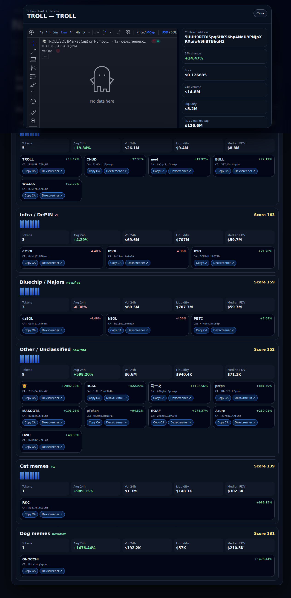

# Birdeye Narrative Rotation Radar

**Narrative Rotation Radar** is a Birdeye-powered Solana market intelligence dashboard that detects which crypto narratives are rotating fastest — not just which individual token is trending.

It clusters Birdeye trending tokens into narratives such as AI agents, meme culture, cat/dog/frog memes, politics, DeFi, infra/DePIN, gaming, RWA, and majors, then scores each narrative by momentum, volume, liquidity, token count, and FDV.

## Why this matters

Most crypto dashboards answer: **"what token is trending?"**

This project answers: **"what narrative is taking over right now?"**

That is more useful for traders, researchers, and community teams because rotations often happen at the narrative layer before one clear winner emerges.

## Features

- Birdeye `token_trending` integration.
- Narrative classification from token symbol/name metadata.
- Rotation score based on:
  - token count
  - average 24h price change
  - 24h volume
  - liquidity
  - median FDV
- Static dashboard with:
  - current top narrative
  - narrative leaderboard
  - per-narrative actionable token cards
  - clickable token names/cards that open chart + token detail panel
  - copyable Solana contract addresses (CA)
  - one-click Dexscreener links for each scanned token
  - history spark bars
  - score deltas
- SQLite persistence for polling/history.
- Optional silent-unless-actionable alert script for Telegram/Hermes cron.
- Read-only analytics only: no wallet, no swaps, no private keys.

## Screenshots



## Quick start

```bash
git clone <repo-url>
cd birdeye-narrative-radar
cp .env.example .env
# edit .env and add your Birdeye API key
npm run fetch
npm run serve
```

Open:

```text
http://localhost:4173
```

## Commands

```bash
npm run fetch   # fetch Birdeye trending data and export latest dashboard JSON
npm run poll    # fetch + persist SQLite history + print alert only if rotation is strong
npm run serve   # serve dashboard at localhost:4173
```

## Environment

See `.env.example`:

```bash
BIRDEYE_API_KEY=your_birdeye_api_key_here
BIRDEYE_CHAIN=solana
BIRDEYE_LIMIT=20
RADAR_ALERT_MIN_SCORE=150
RADAR_ALERT_MIN_SCORE_DELTA=35
RADAR_ALERT_MIN_AVG_24H=15
```

Note: Birdeye `token_trending` currently accepts a max limit of `20` per request. The radar builds deeper insight by polling over time and storing narrative snapshots, not by one oversized request.

## Architecture

```text
Birdeye API
  -> scripts/fetch-birdeye.mjs
  -> data/latest.json
  -> public/data/latest.json
  -> public/index.html

Optional polling mode:
  -> scripts/poll_and_alert.py
  -> data/radar.sqlite
  -> data/history.json
  -> public/data/history.json
  -> optional alert stdout
```

## Scoring model

Each narrative is scored using a weighted blend of:

- narrative breadth: number of matched tokens
- momentum: average 24h price change
- market attention: total 24h volume
- tradability: total liquidity
- valuation context: median FDV

The `Other / Unclassified` bucket is intentionally downweighted so it does not dominate the narrative leaderboard simply because unknown tokens are numerous.

## Submission pitch

**Narrative Rotation Radar turns Birdeye trending token data into higher-level market intelligence.** Instead of showing a flat list of hot tokens, it detects the narratives behind the tokens, scores which themes are rotating, tracks them through time, and can alert when a new meta starts accelerating.

## Safety

- No wallet required.
- No transaction signing.
- No private keys.
- API key is read from `.env`, which is ignored by git.

## License

MIT
